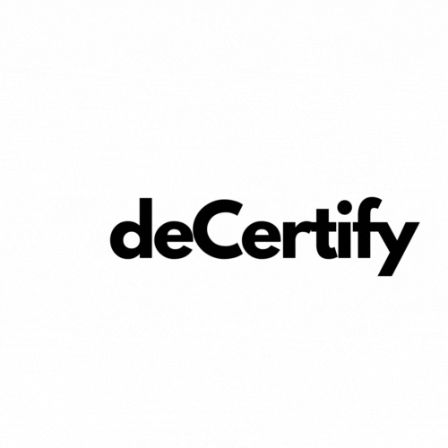
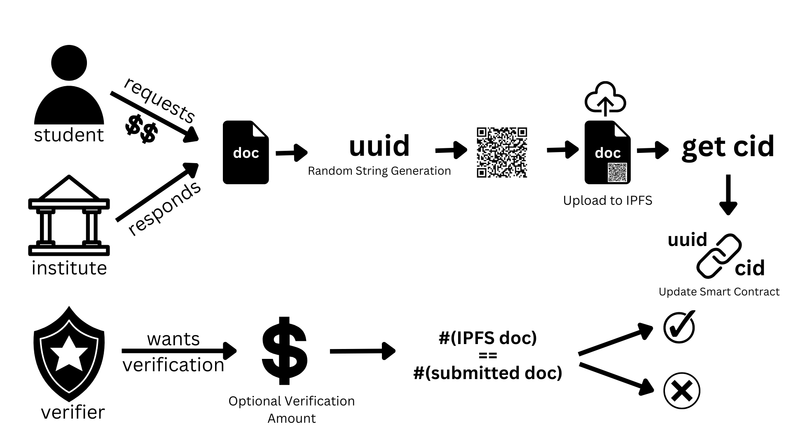

<h1 align="center">
  
   
  deCertify :spiral_notepad:
</h1>

   <strong>deCertify</strong> - Security and Verification of Certificates using the power of BlockChain. 
  DU Hacks 2.0 || Team Trojan Horse.

**Theme:** Web3, Open Innovation.

**Problem Statement:** Certificate Verification using Blockchain.

**deCertify** is a <a href="https://celo.org/">Celo</a> based online certificate verification web and app platform which solves the problem of <b>counterfeiting certificates</b> by leveraging the security provided by Blockchain technology to verify and protect your certificates.

### Features
deCertify offers the following features:
- Complete and Seamless integration with [Celo Blockchain](https://celo.org/).
- Students can request to receive verified documents from Organization.
- Organization can certify documents and upload verified document along with seal of verification(embedded qrcode) to IPFS.
- Any institue or individual seeking verification of documents, can do so by accessing the blockchain and verifying the hash with some optional gas charge.

deCertify works as follows:

1. **Student - App Only**
   In the app, a student can request for an e-certificate to the organization. There might be charges associated with this request to get the documents certified by the organization.

2. **Institute/Organization - Web Only**
   After logging in, the organization can view all pending and approved requests, view their documents and have the option to upload them to IPFS after embedding a seal of verification (QRCode) into the PDF.

3. **Verifier - App Only**
   Suppose an employer wants to verify a document submitted by a student. They can just scan the QR Code on the document and check if it matches with the hash of the IPFS document. A report violation will be generated upon false document detection.

## Resources
- [Demo Video](https://youtu.be/NPaDbadaqvY)
- [GitHub Repository](https://github.com/saRvaGnyA/decertify)
- [Deployed Contract on CeloScan](https://alfajores.celoscan.io/address/0x1CCadcA3488E487b2a1df53Ac800Ca237150F4a7)
- [Devfolio Submission](https://devfolio.co/projects/decertify-7000)

## 🤖Tech-Stack

#### Web
- NextJS
- Tailwind CSS

#### App
- React-Native

#### Blockchain
- Solidity
- Celo

## 🔮Future Scope and Business Potential
- Integrate GraphQL to provide Statistics about the verification requests
- Add Dynamic NFT Support to pass on certificate ownerships from one organization to another (Like School to College). This would ensure seamless, secure and hassle-free custody of documents.
- Provide facility to build a chain of verification on top of organization histories

## 👨‍💻Team Members
- [Sarvagnya Purohit](https://github.com/saRvaGnyA)
- [Ananya Bangera](https://github.com/ananya-bangera)
- [Harsh Nag](https://github.com/Jigsaw-23122002)
- [Neel Shah](https://github.com/Neel-Shah-29)
